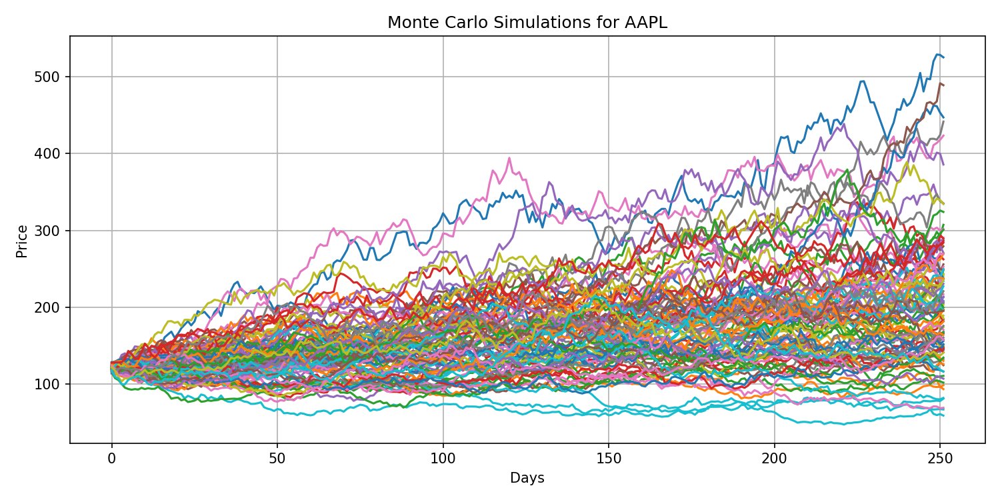
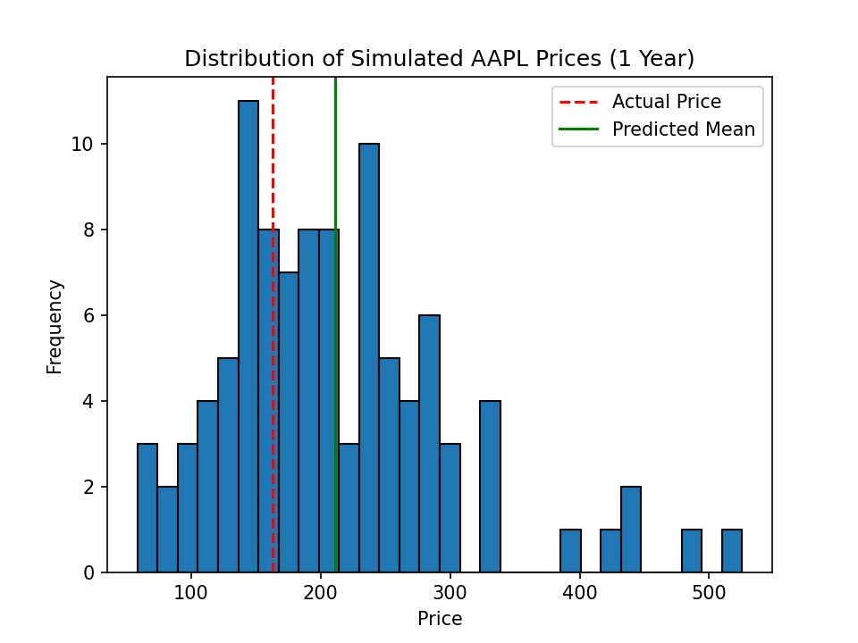

# 📈 Monte Carlo Stock Price Simulation Using Twelve Data API

This project uses real historical stock data to simulate possible future prices using Monte Carlo methods. The goal is to visualize price uncertainty and understand how well such simulations could have predicted actual prices.

- https://twelvedata.com

---

## 🔧 Tools Used

- **Twelve Data API:** For fetching real historical daily stock prices.
- **Python:** Used for all simulation, analysis, and plotting.
- **NumPy, Pandas, Matplotlib:** Key Python libraries used.
- **VSCode + Jupyter Notebooks:** For development, iteration, and visualization.

---

## 🎯 Project Objective

- Simulate 1-year future stock prices for 8 major stocks based on 2020–2021 data.
- Compare the simulation results to actual prices from March 1, 2022.
- Visualize all simulations and final predicted price distributions.
- Analyze accuracy and prediction error.

---

## 💾 Stock Tickers Simulated

```plaintext
AAPL, MSFT, GOOGL, TSLA, META, AMZN, DIS, PFE
```

---

## 🌐 Real-Time API Integration

This project integrates the **Twelve Data API** to fetch historical stock prices programmatically in **JSON format**. Using HTTP requests, Python retrieves structured data for each ticker, which is then processed using **Pandas DataFrames** for simulation.

This automation ensures accuracy, real-world realism, and scalability for expanding the project with more tickers or timeframes.

---

## 📊 Visual Insights

### 🔹 1. AAPL Single Stock Simulation

Shows 100 Monte Carlo paths simulating Apple's stock price in 2022.



---

### 🔹 2. AAPL Distribution vs Actual Price

Histogram of predicted end prices vs the actual price on 2022-03-01.



---

### 🔹 3. All Stock Simulations

Each stock's simulated 1-year price evolution.


---

### 🔹 4. All Final Price Distributions

End-of-year predicted price distribution for all 8 stocks, compared to real prices.

